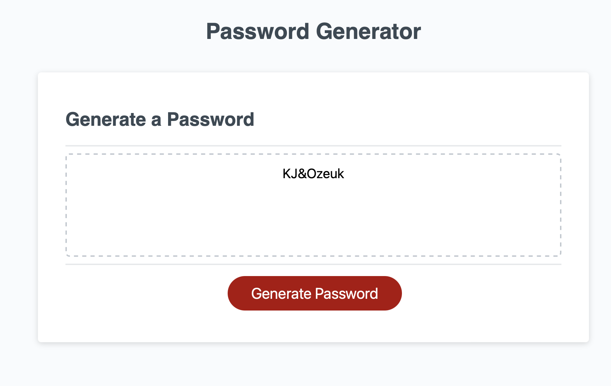

# Lock-and-Key

## Description

- This project was built to test and further demonstrate my understanding of JavaScript principles and it's application. The website generates a random password for the user, while taking into consideration what criteria the user might want for their password. Using arrays consisting of upper case, lower case letters, symbols, numbers, and password length.
Overall, the creation of this project helped me better understand the applications and what is possible when compounding the JavaScript language with a functioning website to enhance user experience. Furthermore, I learned how notoriously tricky the structure of the JavaScript code can be and it will further serve as a learning experience that I can look back to and remember in the future.

## Table of Contents

- [Installation](#installation)

- [Usage](#usage)

- [Credits](#credits)

- [License](#license)

## Installation

N/A

## Usage

- Navigate to [https://alexanderolivares13.github.io/Lock-and-Key]

- Website:

- Click the "Generate Password" button to be prompted with a few questions about the criteria that you would like your password to contain.

- There will be 5 prompts, each asking if you would like to include upper case, lower case letters, special characters, numbers, and how many characters you would like your password to be respectively. After answering all the questions the website will present you with your new password.

- This is the function of the code that determines the outcome and randomizes what character and character types are selected. The code has a "truly" random approach, as every character type has an equal chance of being picked from the list, no matter what character combination you decide to choose.

## Credits

- UofM Bootcamp Content assets and the starter code for challenge 3 can be found at:

[https://git.bootcampcontent.com/University-of-Minnesota/UofM-VIRT-FSF-PT-04-2023-U-LOLC-ENTG/-/tree/main/03-JavaScript/02-Challenge]

## License

- Please refer to the License in the repo
